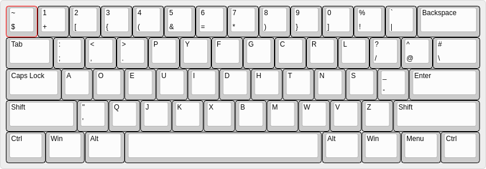

# dvorakium
A comfy modified hybrid of Dvorak and Programmer's Dvorak.

## Installation
1. Copy `dvorakium` to `/usr/share/X11/xkb/symbols/`
2. `localectl --no-convert set-x11-keymap dvorakium "" "" ctrl:swapcaps` (*turn caps into ctrl for ultimate comfy*)
3. Profit???
